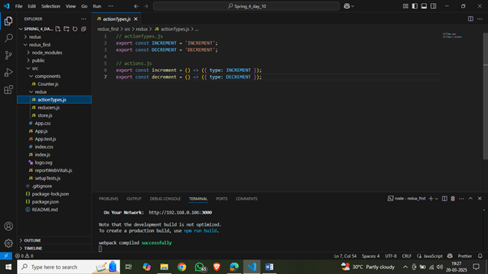
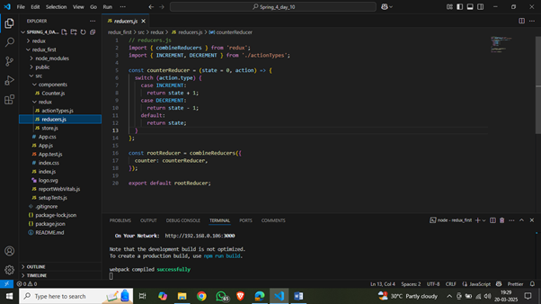
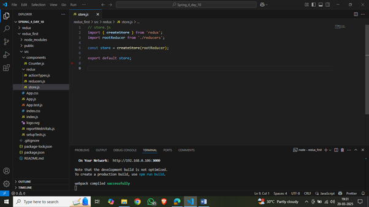
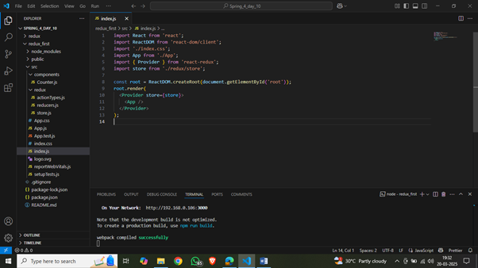
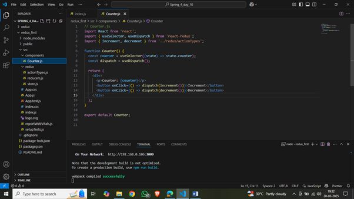
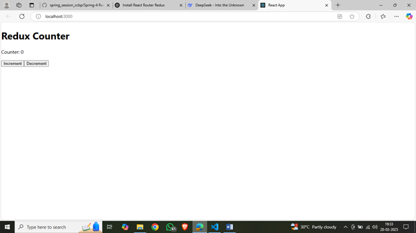
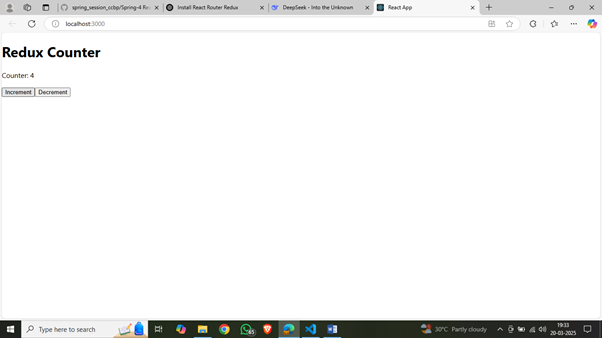

npm install redux react-redux


# **Redux: Comprehensive Notes**

Redux is a **state management library** for JavaScript applications, commonly used with React. It provides a centralized store to manage the state of your application, making it easier to debug, test, and maintain. Redux is particularly useful for large applications with complex state logic.

- Redux is a state management library for JavaScript applications, commonly used with React. It provides a centralized store to manage the state of your application, making it easier to debug, test, and maintain.
- Redux is particularly useful for large applications with complex state logic.
- The core idea behind Redux is that the entire application state is stored in a single store, and this state is immutable, meaning it cannot be changed directly. Instead, to change the state, actions are dispatched, which are then handled by reducers to produce a new state.


---

## **1. What is Redux?**
- Redux is a predictable state container for JavaScript apps.
- It helps you manage **global state** in a consistent way.
- Redux is based on three core principles:
  1. **Single Source of Truth**: The entire state of the app is stored in a single **store**.
  2. **State is Read-Only**: The only way to change the state is by dispatching an **action**.
  3. **Changes are Made with Pure Functions**: Reducers specify how the state changes in response to actions.

---

---
Key Features:
•	Provides the Provider component to make the Redux store available in the React component tree.
•	Provides hooks like useSelector (to read state) and useDispatch (to dispatch actions).
•	Works with plain Redux but requires a lot of boilerplate code.


---
## **2. Core Concepts**

### **a. Store**
- The **store** is a JavaScript object that holds the entire state of the application.
- It is created using the `createStore` function (or `configureStore` in Redux Toolkit).
- Example:
  ```jsx
  import { createStore } from 'redux';

  const store = createStore(rootReducer);
  ```

### **b. Actions**
- **Actions** are plain JavaScript objects that describe what happened in the app.
- They must have a `type` property (usually a string constant) and can optionally include a `payload`.
- It typically contains two properties:
        o	type: A string that describes the action.
        o	payload (optional): Additional data that provides context about the action.

- Example:
  ```jsx
  const increment = () => ({
    type: 'INCREMENT',
  });
  ```

### **c. Reducers**
- **Reducers** are pure functions that specify how the state changes in response to actions.
- The reducer is responsible for determining how the state should change based on the action.
- They take the current state and an action as arguments and return the new state.
- Example:
  ```jsx
  const counterReducer = (state = 0, action) => {
    switch (action.type) {
      case 'INCREMENT':
        return state + 1;
      case 'DECREMENT':
        return state - 1;
      default:
        return state;
    }
  };
  ```

### **d. Dispatch**
- **Dispatch** is a function provided by the store to send actions to the reducer.
- Dispatching an action means triggering a state change by sending an action to the reducer.
- This is how you inform Redux that something has happened and the state may need to be updated.
- A method used to send actions to the store to update the state
- Example:
  ```jsx
  store.dispatch(increment());
  ```

### **e. Selectors**
- **Selectors** are functions used to extract specific pieces of state from the store.
- Example:
  ```jsx
  const selectCounter = (state) => state.counter;
  ```

---

## Benefits of Redux:
•	Predictable State: Since the state is immutable and changes only through pure functions (reducers), the application behaves in a predictable way.
•	Single Source of Truth: All state is stored in a single store, making it easy to manage and debug.
•	DevTools: Redux comes with great debugging tools like the Redux DevTools extension, which allows time-travel debugging.
## Downsides of Redux:
•	Boilerplate: It can introduce a lot of boilerplate code for simple applications (e.g., writing actions, reducers, etc.).
•	Complexity: For small applications, Redux might be overkill since managing state locally within React's built-in hooks might be simpler.
When to use Redux?
•	When your application has a lot of shared or global state that needs to be accessed or modified by many components.
•	If your app is complex and you need better state management across different parts of the app.
In smaller apps, the context API or React hooks (useState, useReducer) might suffice instead of Redux.


## **3. Setting Up Redux** React Redux (Without Redux Toolkit)

### **Step 1: Install Redux**
Install Redux and React-Redux (for React integration):
```bash
npm install redux react-redux
```

Steps:
•	Manually define action types, action creators, and reducers.
•	Use createStore and Provider to connect Redux to React.

### **Step 2: Create Actions**
Define action types and action creators:
```jsx
// actionTypes.js
export const INCREMENT = 'INCREMENT';
export const DECREMENT = 'DECREMENT';

// actions.js
export const increment = () => ({ type: INCREMENT });
export const decrement = () => ({ type: DECREMENT });
```

### **Step 3: Create Reducers**
Combine reducers using `combineReducers`:
```jsx
// reducers.js
import { combineReducers } from 'redux';
import { INCREMENT, DECREMENT } from './actionTypes';

const counterReducer = (state = 0, action) => {
  switch (action.type) {
    case INCREMENT:
      return state + 1;
    case DECREMENT:
      return state - 1;
    default:
      return state;
  }
};

const rootReducer = combineReducers({
  counter: counterReducer,
});

export default rootReducer;
```

### **Step 4: Create the Store**
Create the store and pass it to the app using the `Provider` component:
```jsx
// store.js
import { createStore } from 'redux';
import rootReducer from './reducers';

const store = createStore(rootReducer);

export default store;

// index.js
import React from 'react';
import ReactDOM from 'react-dom';
import { Provider } from 'react-redux';
import store from './store';
import App from './App';

ReactDOM.render(
  <Provider store={store}>
    <App />
  </Provider>,
  document.getElementById('root')
);
```

### **Step 5: Connect Components**
Use `useSelector` and `useDispatch` hooks to interact with the store:
```jsx
// Counter.js
import React from 'react';
import { useSelector, useDispatch } from 'react-redux';
import { increment, decrement } from './actions';

function Counter() {
  const counter = useSelector((state) => state.counter);
  const dispatch = useDispatch();

  return (
    <div>
      <p>Counter: {counter}</p>
      <button onClick={() => dispatch(increment())}>Increment</button>
      <button onClick={() => dispatch(decrement())}>Decrement</button>
    </div>
  );
}

export default Counter;
```

Exmaple:
a) 
b) 
c) 
d) 
e) 
f) 
g) 

---

## **4. Redux Toolkit (Modern Redux)**
Redux Toolkit simplifies Redux setup and reduces boilerplate code. It includes utilities like `createSlice`, `configureStore`, and `createAsyncThunk`.

### **Step 1: Install Redux Toolkit**
```bash
npm install @reduxjs/toolkit
```

### **Step 2: Create a Slice**
A slice automatically generates action creators and reducers:
```jsx
// counterSlice.js
import { createSlice } from '@reduxjs/toolkit';

const counterSlice = createSlice({
  name: 'counter',
  initialState: 0,
  reducers: {
    increment: (state) => state + 1,
    decrement: (state) => state - 1,
  },
});

export const { increment, decrement } = counterSlice.actions;
export default counterSlice.reducer;
```

### **Step 3: Configure the Store**
Use `configureStore` to set up the store:
```jsx
// store.js
import { configureStore } from '@reduxjs/toolkit';
import counterReducer from './counterSlice';

const store = configureStore({
  reducer: {
    counter: counterReducer,
  },
});

export default store;
```

### **Step 4: Connect Components**
Use the same `useSelector` and `useDispatch` hooks:
```jsx
// Counter.js
import React from 'react';
import { useSelector, useDispatch } from 'react-redux';
import { increment, decrement } from './counterSlice';

function Counter() {
  const counter = useSelector((state) => state.counter);
  const dispatch = useDispatch();

  return (
    <div>
      <p>Counter: {counter}</p>
      <button onClick={() => dispatch(increment())}>Increment</button>
      <button onClick={() => dispatch(decrement())}>Decrement</button>
    </div>
  );
}

export default Counter;
```

---

## **5. Best Practices**
1. **Use Redux Toolkit**: It simplifies Redux setup and reduces boilerplate.
2. **Normalize State**: Store data in a normalized form (e.g., using IDs as keys).
3. **Use Selectors**: Extract state using selectors for better performance and reusability.
4. **Avoid Overusing Redux**: Use Redux only for global state. For local state, prefer `useState` or `useReducer`.
5. **Use Middleware**: Use middleware like `redux-thunk` or `redux-saga` for side effects (e.g., API calls).

---

## **6. Example: Full Application**
Here’s a complete example of a React app using Redux Toolkit:

```jsx
// counterSlice.js
import { createSlice } from '@reduxjs/toolkit';

const counterSlice = createSlice({
  name: 'counter',
  initialState: 0,
  reducers: {
    increment: (state) => state + 1,
    decrement: (state) => state - 1,
  },
});

export const { increment, decrement } = counterSlice.actions;
export default counterSlice.reducer;

// store.js
import { configureStore } from '@reduxjs/toolkit';
import counterReducer from './counterSlice';

const store = configureStore({
  reducer: {
    counter: counterReducer,
  },
});

export default store;

// Counter.js
import React from 'react';
import { useSelector, useDispatch } from 'react-redux';
import { increment, decrement } from './counterSlice';

function Counter() {
  const counter = useSelector((state) => state.counter);
  const dispatch = useDispatch();

  return (
    <div>
      <p>Counter: {counter}</p>
      <button onClick={() => dispatch(increment())}>Increment</button>
      <button onClick={() => dispatch(decrement())}>Decrement</button>
    </div>
  );
}

export default Counter;

// index.js
import React from 'react';
import ReactDOM from 'react-dom';
import { Provider } from 'react-redux';
import store from './store';
import Counter from './Counter';

ReactDOM.render(
  <Provider store={store}>
    <Counter />
  </Provider>,
  document.getElementById('root')
);
```

---

## **7. Conclusion**
Redux is a powerful tool for managing global state in large applications. By following best practices and using Redux Toolkit, you can simplify your code and build scalable, maintainable apps. Use Redux wisely to avoid unnecessary complexity!