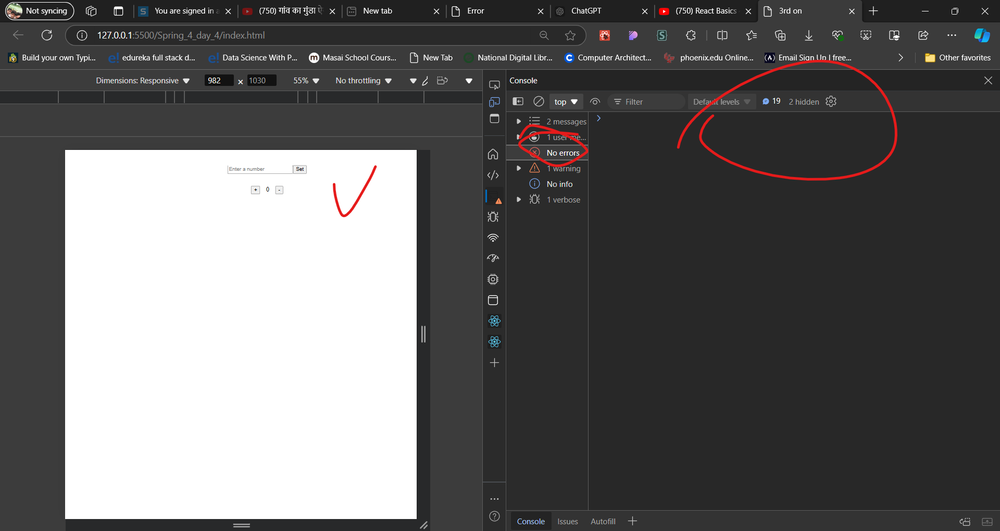
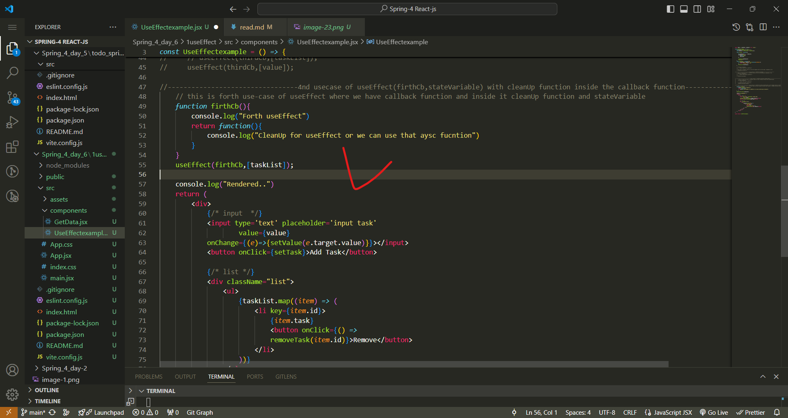

paste the babel cdn
ex- 

--------------------------------------------------------------------------------------------------------------------------
spring_4_day_4

1) when we controll the UI change of elements like inputs state then these components are know to be controlled components
2) we need a ting that creates us a normal react app structure and also it sholud provide variaous functionality in order to bulid a complex application using react. that is  bundler
3) so we have main three bundler to create react app
   1) create-react-app(CRA)
   2) Vite
   3) Parcel
   start with vite
4) npm = node package modules it is not , it is except the node package modules
5) npm -> is a ocean of packages that server what ever a developer needs to build
6) npx create-react-app-> creat a react app, but it execute the nom package modules
---------------creating react app using vite-----------------
1) npm install -D vite
2) create a index.html file
--------------------other way also--------------
1) npm create vite@latest
2) Project name: ... secondVite
    √ Package name: ... secondvite
    √ Select a framework: » React
    √ Select a variant: » JavaScript
3) cd secondVite
  npm install
  npm run dev

* install the extension ES7+ React/Redux/React-Native snippets
* 
-------------------------------------------------------------------
--------to create any dynamic website you should to follow below steps
1) create the static version of that website
2) we need to figure out where to add dynamic nature to webpage i.e, adding state 
3) divede the code you have written into components if possible
4) check if the logic and code are working with tests
---------------------------------------------------------------------
--------------------create a todo app-------------------------
step-1: create the static version of that website

1) npm create vite@latest
2) cd 3_todo
  npm install
  npm run dev
3) modify the codes

step-2:we need to figure out where to add dynamic nature to webpage i.e, adding state 

--------------------------------------------------------------------------------------------------
spring_4_day-6 : for router and useeffect concetp

step-1: npm create vite@latest
step-2:   cd 1useEffect
          npm install
          npm run dev
step-3; 

--------------------
useEffect is used to call a function onec the render catually happped
ex--

output-

note--
focess this error 

we should not usse the async with useEffect beause async return the promises and useEffect must not return anything besides a function, which is used for clean-up. so for that we we use a function which have this async to fetch the data. 
solve-

--------------------
-----------------useEffect() usecase-1: with empty dependecy array like- useEffect(func,[])--------------------------------------
so,

--output---

by observing output we can say that if the useEffect has empty array dependecy then that useEffect will call one time after once render not after each render.
-----------------useEffect() usecase-2: with empty dependecy array like- useEffect(func)---------------------

--output--

so by observing the output we can say that if we have useEffect without  empty array then that useEffect will call each time after the render.

-----------------useEffect() usecase-3: with  dependecy array like- useEffect(func,dependecy_aarray)---------------------

--output---

now after clcik on ad-task button 

here after click on add-task button that useEffect has call beausce in that depenecy array we mantain the taskList to change its state.
now see to inpput fileds
code image--

--output--

-----------------useEffect() usecase-4: with callback inside callback cleanUp functiion and dependecy array like- useEffect(func)---------------
code--

--output---

then after clcik on add task

----------now routrs----------------------------------------
npm create vite@latest
cd 2nd_1Routing
  npm install
  npm run dev
---
react-router---> 
1) for the 1st render we get a bundle with UI + Data 
2) in single page application , no reload should take place  why?, beacuse as reload means getting both UI + Data thats why react works in a way where response only have Data comming from server.
3) when our website got relaod then all the data related to that website will stored in router and based on url it will render, that data.
4) install the npm install react-router-dom
