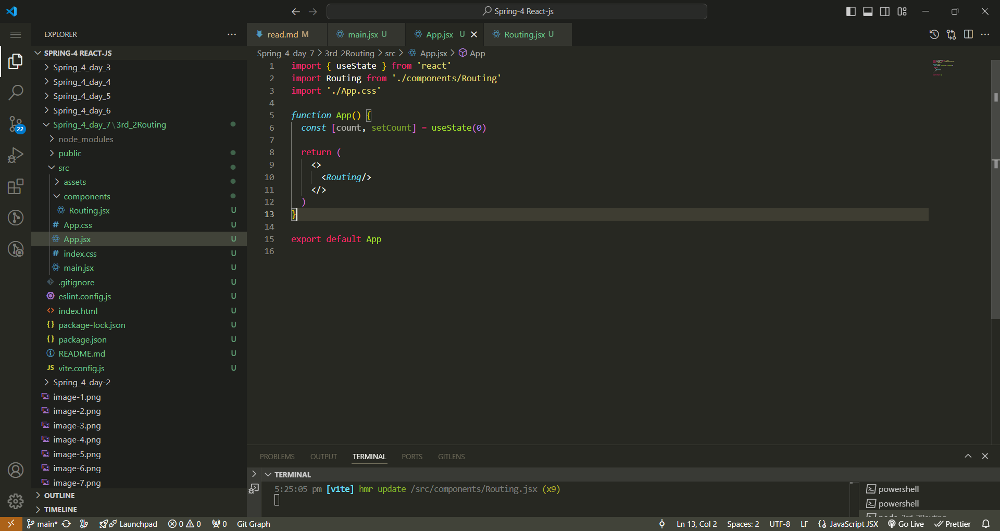
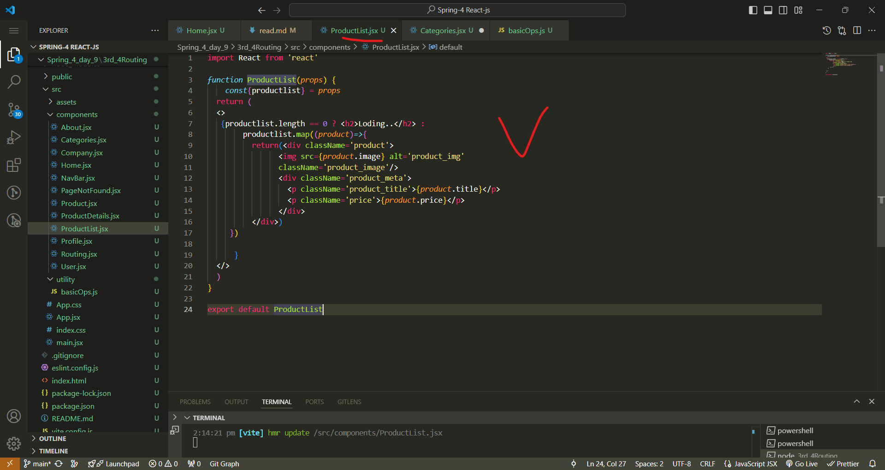
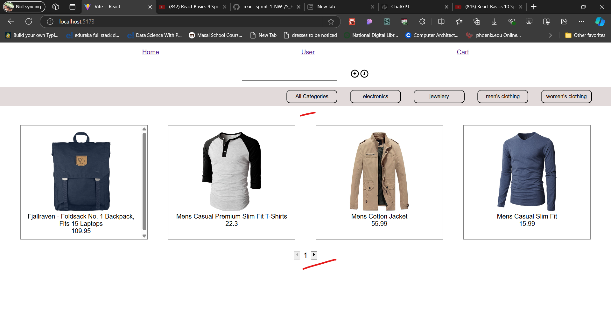
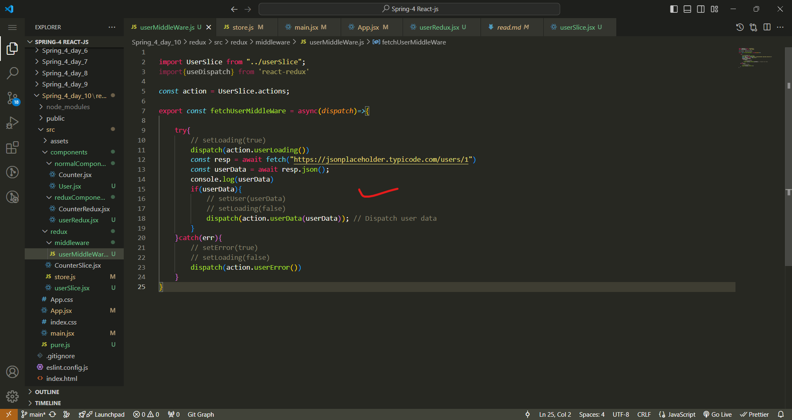

paste the babel cdn
ex- <script src="https://unpkg.com/@babel/standalone/babel.min.js"></script>

#### ----------------------------spring_4_day_1--------------------------------------------------
1) 
2) 
3) 
4) 
## 1 (Q) in the html we are writing into code which is visible to screen is js object why ---------------------------
## ans--
In web development, the content that you see on the screen (HTML) isn't directly a JavaScript object, but JavaScript can interact with it through something called the **Document Object Model (DOM)**.

Here’s how it works:

1. **HTML to DOM Conversion:**
   - When the browser loads an HTML document, it parses the HTML code and creates a structured representation of the document known as the **DOM**.
   - The DOM is essentially a tree of objects, where each HTML element (like `<div>`, `<p>`, etc.) is represented as a **JavaScript object**. This allows scripts to access and manipulate the structure, style, and content of the web page.

2. **JavaScript Manipulation:**
   - JavaScript interacts with the DOM to dynamically change the content, structure, and styling of a webpage. For example, you can add new elements, modify existing elements, or respond to user events.
   - When you manipulate the DOM using JavaScript, you’re essentially working with JavaScript objects that represent the HTML elements on the page.

3. **Why is it a JavaScript Object?**
   - The browser's JavaScript engine converts the HTML elements into JavaScript objects so that JavaScript code can easily interact with and manipulate them.
   - These objects have properties and methods that allow you to change things like the text inside an element, its styling, or even its position in the DOM tree.

In summary, while the HTML code itself isn’t a JavaScript object, it’s represented as objects in the DOM so that JavaScript can manipulate the webpage dynamically.

5) 
6) 
6) 
7) 
8) 
9) 
10) 
11) 
12) 
13) 
14) 
15) 
16) 
17) 
18) 
19) 
20) there is a onlion compilar for React-js that is called as replit.com
21) 

## ------------------------------- 2.Q Reconciliation oR State-Managment--------------------------------------------
## ans
**Reconciliation** is an important concept in **React.js** and is related to how React updates the UI efficiently. It refers to the process of updating the **Virtual DOM** to reflect the changes in the **real DOM**.

### What is Reconciliation?

In React, the **Virtual DOM** is a lightweight, in-memory representation of the real DOM. When the state or props of a React component change, React doesn't immediately update the real DOM. Instead, it performs the following steps:

1. **Rendering the New Virtual DOM:**
   - When there is a change in the application state, React creates a new Virtual DOM tree that represents the updated UI.

2. **Diffing Algorithm:**
   - React uses a "diffing" algorithm to compare the new Virtual DOM tree with the previous Virtual DOM tree.
   - It checks which parts of the Virtual DOM have changed and identifies the minimum number of changes required to update the real DOM.

3. **Batching and Updating the Real DOM:**
   - React applies only the necessary updates to the real DOM, based on the changes found in the diffing step. This minimizes the number of DOM manipulations and makes the process more efficient.

### Why is Reconciliation Important?

- **Performance Optimization:** Directly manipulating the real DOM can be slow and costly in terms of performance. By using a Virtual DOM and only updating the parts that actually changed, React minimizes the number of updates to the real DOM, making the app faster.
- **Predictability:** React's reconciliation process ensures that the UI stays in sync with the application's state in a predictable way.

### Key Points in Reconciliation:

1. **Component Re-rendering:**
   - When a component's state or props change, React triggers a re-render for that component. The Virtual DOM is updated, and reconciliation begins.

2. **Keys for List Items:**
   - When rendering a list of elements, React uses a special `key` attribute to track elements. This helps in efficiently reordering and updating list items during reconciliation.

3. **Component Type Matching:**
   - React first compares the type of the component (e.g., `<div>` vs. `<span>`). If the types are different, it removes the old component and mounts a new one.
   - If the types are the same, it updates the existing component with the new properties and state.

### Reconciliation  in JavaScript (Vanilla JS)

In plain JavaScript (vanilla JS), there isn't a built-in reconciliation process like in React. When you manually manipulate the DOM, you have to manage the updates yourself, potentially leading to more complex and error-prone code. React's reconciliation process abstracts this complexity away and provides a more efficient way of updating the UI.

### Conclusion

Reconciliation is a core concept in React.js that ensures efficient and optimal updates to the user interface by comparing the Virtual DOM with the real DOM and making only the necessary changes. This process is what makes React fast and responsive, especially in large-scale applications.


## -----------------------end of spring 4 day 1 -----------------------------
## ------------------------- Spring-4 day-2 ----------------------------------

1) 
2) 
3) 
4) 
5) 
6) 
7) 
8) 
9) 
10) 
11) 
12) 
13) 
14) 
15) 
16) 
17) 
18) 
19) 
20) .jpg>)
## Q --------------- difference between React ReactDom  and render()  -----------------------
## ans 
In React, `React`, `ReactDOM`, and `render()` each serve distinct purposes. Let's break down the differences:

### 1. **React**

- **What is React?**
  - `React` is the core library used for building user interfaces, specifically for creating components. It provides the necessary functions and classes to define and work with React components.
  - When you import `React` in your project, you are bringing in the tools needed to create components, manage state, and handle lifecycle methods.

- **Common Uses:**
  - Creating components: `React.Component` or functional components.
  - Using hooks like `useState`, `useEffect`, etc.
  - Working with JSX (JavaScript XML), which allows you to write HTML-like code in JavaScript.

```javascript
import React from 'react';

// Example usage
const MyComponent = () => <h1>Hello, World!</h1>;
```

### 2. **ReactDOM**

- **What is ReactDOM?**
  - `ReactDOM` is a separate package from `React` that provides methods specifically for interacting with the DOM (Document Object Model).
  - It acts as a bridge between React components and the actual DOM, allowing you to render React components to the web page.

- **Common Uses:**
  - Rendering a React component to the root DOM node (usually done once in a typical React application).
  - Handling methods like `ReactDOM.createPortal` for rendering content outside of the main component tree.

```javascript
import ReactDOM from 'react-dom';

// Example usage
ReactDOM.render(<MyComponent />, document.getElementById('root'));
```

### 3. **render()**

- **What is render()?**
  - `render()` is a method provided by `ReactDOM` used to render a React element (or component) into a specified DOM container.
  - It is typically used at the entry point of a React application to render the root component into the HTML element, often with the `id="root"`.

- **How it Works:**
  - `ReactDOM.render(component, container)` takes two arguments:
    1. **Component:** The React element or component to render.
    2. **Container:** The DOM node where the component should be rendered.

```javascript
import React from 'react';
import ReactDOM from 'react-dom';

// Define a component
const MyComponent = () => <h1>Hello, World!</h1>;

// Render the component to the DOM
ReactDOM.render(<MyComponent />, document.getElementById('root'));
```

### Summary of Differences

| Feature        | Description                                                                                         | Use Case                                                       |
|----------------|-----------------------------------------------------------------------------------------------------|----------------------------------------------------------------|
| `React`        | Core library for creating and managing components, state, and lifecycle methods.                    | Importing to define components and use hooks.                  |
| `ReactDOM`     | Provides methods for interacting with the DOM, such as rendering components.                        | Importing to render components to the web page.                |
| `render()`     | A method of `ReactDOM` used to render a React component to a specified DOM element.                 | Calling it to mount the root component in a React application. |

In modern React (version 18 and above), `ReactDOM.createRoot()` is used instead of `ReactDOM.render()` for improved performance and concurrent rendering capabilities.

## exapple in real life 
react is a developer person
reactDom is a programming lagauge
render method is a feactures of programing language by using that developer can do naything.


## -------------------- end of spring-4 day-2 ---------------------------------------------------------
## ---------------------spring-4 day-3-------------------------------------------------------------------
1) 
2) 
3) 
4) 
5) 
6) 
7) 
8) 
9) 
10) 
11) 
12) 
13) 
14) 
15) 
16) 
17) 
18) 
19) 
20) 
21) 

## ------------------ end --------------------------------------

--------------------------------------------------------------------------------------------------------------------------
## ----------------------------spring_4_day_4-------------------------------------


1) when we controll the UI change of elements like inputs state then these components are know to be controlled components
2) we need a ting that creates us a normal react app structure and also it sholud provide variaous functionality in order to bulid a complex application using react. that is  bundler
3) so we have main three bundler to create react app
   1) create-react-app(CRA)
   2) Vite
   3) Parcel
   start with vite
4) npm = node package modules it is not , it is except the node package modules
5) npm -> is a ocean of packages that server what ever a developer needs to build
6) npx create-react-app-> creat a react app, but it execute the nom package modules
---------------creating react app using vite-----------------
1) npm install -D vite
2) create a index.html file
--------------------other way also--------------
1) npm create vite@latest
2) Project name: ... secondVite
    √ Package name: ... secondvite
    √ Select a framework: » React
    √ Select a variant: » JavaScript
3) cd secondVite
  npm install
  npm run dev


* install the extension ES7+ React/Redux/React-Native snippets
* 
-------------------------------------------------------------------
--------to create any dynamic website you should to follow below steps
1) create the static version of that website
2) we need to figure out where to add dynamic nature to webpage i.e, adding state 
3) divede the code you have written into components if possible
4) check if the logic and code are working with tests
---------------------------------------------------------------------
--------------------create a todo app-------------------------
step-1: create the static version of that website

1) npm create vite@latest
2) cd 3_todo
  npm install
  npm run dev
3) modify the codes


step-2:we need to figure out where to add dynamic nature to webpage i.e, adding state 


--------------------------------------------------------------------------------------------------
## --------------------spring_4_day_5 ------------------------------------------------------------
Q - what is incese in scale for components
-> extension for react-js in vs code is --- ES7 + React/Redux/React-Native snippets
---------------------- note------------------------------------
in React when ever a parent components want to communicate with child components then that will happped by props 
  but
  when child components wnat to communicate with parent then that will happped by the function(callback)


## -----------------------spring_4_day-6 : for router and useeffect concetp-------------------------------------

step-1: npm create vite@latest
step-2:   cd 1useEffect
          npm install
          npm run dev
step-3; 

--------------------


useEffect is used to call a function onec the render catually happped
ex--


output-


note--
focess this error 

we should not usse the async with useEffect beause async return the promises and useEffect must not return anything besides a function, which is used for clean-up. so for that we we use a function which have this async to fetch the data. 
solve-


--------------------
-----------------useEffect() usecase-1: with empty dependecy array like- useEffect(func,[])--------------------------------------
so,


--output---


by observing output we can say that if the useEffect has empty array dependecy then that useEffect will call one time after once render not after each render.
-----------------useEffect() usecase-2: with empty dependecy array like- useEffect(func)---------------------

--output--


so by observing the output we can say that if we have useEffect without  empty array then that useEffect will call each time after the render.

-----------------useEffect() usecase-3: with  dependecy array like- useEffect(func,dependecy_aarray)---------------------


--output---


now after clcik on ad-task button 

here after click on add-task button that useEffect has call beausce in that depenecy array we mantain the taskList to change its state.
now see to inpput fileds
code image--

--output--


-----------------useEffect() usecase-4: with callback inside callback cleanUp functiion and dependecy array like- useEffect(func)---------------
code--


--output---

then after clcik on add task


----------now routrs----------------------------------------
npm create vite@latest
cd 2nd_1Routing
  npm install
  npm run dev
---
react-router---> 
1) for the 1st render we get a bundle with UI + Data 
2) in single page application , no reload should take place  why?, beacuse as reload means getting both UI + Data thats why react works in a way where response only have Data comming from server.
3) when our website got relaod then all the data related to that website will stored in router and based on url it will render, that data.
4) install the npm install react-router-dom

## ---------------------------------------spring_4_day_7: for router concept-----------------------------
1) npm create vite@latest
2) 3rd_2Routing
3)  cd 3rd_2Routing
  npm install
  npm run dev
4)  npm install react-router-dom

## --------- use this website to use the apis ---------------

----------------------------------------------------------------
5) six types of Routing 
   1) Normal Routing
   2) Link Routing
   3) Dynamic Routing/ emplate Routing
   4) Nested Routing
   5) custom Routing
   6) Redirecting Routing

6) Link Routing--> when ever we yse the Link tag then reload doesn't happend when we go from one page to other using this Link tag.   
 


--output----


 1) Dynamic Routing/ emplate Routing---> it is used to create a dynatic route path 
   1) useParams()--> Returns an object of key/value pairs of the dynamic params from the current URL that were matched by the route path
   
   
-----------------------------------
   
   
----------------------------------

--output---


---------------------------------------------------------
Q- how to make our route redirect to some link or some page autometically.
ans--> 

to 

ans--> using the six type of Rotuting called as Redirecting Routing 


--output----


---------------------------------------------------------------
problem--
  to fix this type of proble we are using the  4) Nested Routing
 examplee--
 
 -------------------------
 
 
 
 
 

 -----------------
 
## ------------------------------------------------------------------------------------------------------------------
## ------------------Spring_4_day_8 continue the project-----------------------------------------------------------
1) npm create vite@latest
  3rd_3Routing
  cd 3rd_3Routing
  npm install
  npm install react-router-dom
  npm run dev
2) copy all the code of Spring_4_daay_7 and then continuneee
3)  go to thie website for style https://mui.com/material-ui/
4)  go to get stated and click on installation and copy the command and paste in terminal.
5)  
6)  
7)  npm install @mui/material @emotion/react @emotion/styled
8)   copy the and paste in code of Home
9)  
10) it is comming error so comment it 
11) 
12) to fix this error again  in terimal  npm install @mui/icons-material
13) 
14) 
15) 
16) 
17) 
18) 
19) now to filter the itmes based on category 
20) this are the apis  , 
21) now to fetch the data based on category we have to write the code using the useEffect().
22) 
23) 
24) 
25) -------output------------------
26) 
27) 
28) 
29) 
--------------------

## -------------------------------------Spring_4_day_9------------------------------------------------------------------
1) npm create vite@latest
  3rd_3Routing
  cd 3rd_4Routing
  npm install
  npm install react-router-dom
  npm install @mui/material @emotion/react @emotion/styled
  npm install @mui/icons-material 
  npm run dev
2) copy all the code of Spring_4_daay_8 and then continune
3) now we are going to do refectring the our code--> means mantaing the code in proper way with respect to file and folder.
4) create two components 1) Categories.jsx 2)ProductList.jsx 
5) create a folder as utility and create a file basicOp.js inside that utility
6) see the codes
7) Categories.jsx code is 
8) 
9) ProductList.jsx code is 
10) 
11) utility->basicOp.js code is 
12) 
13) 
14) now Home.jsx code is 
15) 
16) 
17) 
18) output is 
19) 
20) 
21) ------------------Now we are going to apply the paggination feacture to this project--------------------------------------
22) now to include the icons in react we can use the react-icons for that follow the below image to include the react-icon first we need to download it using ternimal => npm install react-icons
23) 
24) now see the codes 
25) code of Home.jsx file  , 
26) code of ProductList.jsx file 
27) code of Category.jsx file 
28) code of utility->basicOp.js file ,
29) -----------------output-----------------------
30) ,,
31) after this all output there is some few debugging problems are  below..
32) when we click on parttiular category then that page number is not update as initall -> 
33) intiall we are in first page but when we are searching a product which is not availabe in first page(within four product) then other page product is comming which match the search 
34) now we fix this begging by modify the codes and we also create two files User2.jsx and Cart.jsx
35) see the code to create and modify the code , 
36) now we  are going to fix the debugging see the code.
37) Home.jsx code is   , 
38) Category.jsx file code is  here we are modify the code of Home.jsx and Category.jsx beasus in the home.jsx that input fild are there and in the Category.jsx that all the category are there on click them we are not getting proper output after this all we are getting proper output..
39) ---- output-----------------------
40)  ,  , 
41)  , 
42) now one more begugging is there when we click on other link like on user or cart after that when we click on again in Home then that product are comming from starting but not from where we click on that other link like if we are in second page of home and we click on cart then again we clik on Home then it will code as first page  that is bed user expereance so to fix that degging we have to apply the concept of 'context'.....
43)  we know that when two or more child element of same parent element want the a same state-managemt varaible then we keep that state variable in parent element in form of props so that all the child element can access so when child component want a property from parent element and there is long chain between child element to parent element where parent have the state variable to sent it to child it can have a problem called as prop drilling
44)  Prop drilling in React refers to the process of passing data from a parent component to a deeply nested child component through several intermediary components, even though those intermediary components do not need the data. It can lead to complicated and difficult-to-maintain code when many components are involved.
45) ## ------------- How to Avoid Prop Drilling------------->
     ans)React Context API: The Context API allows you to create global variables (context) that can be passed down to any child component without needing to pass props explicitly at every level.

46)   by lokking this image there the parent elemnt is App.jsx and child are navbar.jsx and user.jsx so if the user.jsx need a property then it can direncty access from context api that is gloably access across each compoents.
47)  now to use the Context in this application we are crating a folder name as contexts and inside it we are creating a file to handle the paddingtion that file is PaginationContext.jsx.
48)  see the codes with respect to files 
49)  App.jsx code is 
50)  Home.jsx code is  ,  , 
51) code of PaginationContext.jsx file  
52) Categories.jsx file code is 
53) code of NavBar.jsx and Productlist.jsx file 
54) -------------OutPut---------------------
55)  ,  ,  , 
56) so by above image we can see the proble which was happing that had resolved but that is for also related to pagitation but for categories by lokking the below image you can identify so to resolve it also we need to make the category state variable as glabally using the context variable.  ,  , 
57) ## ---------------------------------------------------------------------------------------------------------------------

## ---------------------------------------Spring_4_day_10 redux concept ------------------------------------------------------
58) npm create vite@latest
    cd redux
    npm install
    npm install react-redux
    npm run dev
59) ## ------------- what is redux and give the some details about it -------------------------------
    ans- 
    
    ### What is Redux?
Redux is a state management library that is widely used with JavaScript applications, particularly with React. It helps manage the state of your application in a predictable way. The core idea behind Redux is that the entire application state is stored in a single **store**, and this state is immutable, meaning it cannot be changed directly. Instead, to change the state, **actions** are dispatched, which are then handled by **reducers** to produce a new state.

### Key Concepts of Redux:

1. **Store**:
   - The store holds the entire state of the application in one place.
   - It is a single source of truth, meaning all data relevant to the application is stored in one object.
   - Example:
     ```javascript
     const store = createStore(reducer);
     ```

2. **Action**:
   - An action is a plain JavaScript object that describes what happened.
   - It typically contains two properties:
     - `type`: A string that describes the action.
     - `payload` (optional): Additional data that provides context about the action.
   - Example:
     ```javascript
     const incrementAction = { type: 'INCREMENT' };
     const addAction = { type: 'ADD', payload: 5 };
     ```

3. **Reducer**:
   - A reducer is a pure function that takes the current state and an action as arguments and returns a new state.
   - The reducer is responsible for determining how the state should change based on the action.
   - Example:
     ```javascript
     const counterReducer = (state = 0, action) => {
       switch (action.type) {
         case 'INCREMENT':
           return state + 1;
         case 'ADD':
           return state + action.payload;
         default:
           return state;
       }
     };
     ```

4. **Dispatch**:
   - Dispatching an action means triggering a state change by sending an action to the reducer.
   - This is how you inform Redux that something has happened and the state may need to be updated.
   - Example:
     ```javascript
     store.dispatch({ type: 'INCREMENT' });
     ```

5. **Selectors**:
   - Selectors are functions used to retrieve specific data from the state.
   - They help isolate the logic for accessing the state in a clean and reusable way.
   - Example:
     ```javascript
     const getCounterValue = (state) => state.counter;
     ```

### Example of a Simple Redux Flow:

1. **Actions**: A user clicks a button to increment a counter.
   ```javascript
   const increment = { type: 'INCREMENT' };
   ```

2. **Reducers**: The reducer listens to the action and updates the state.
   ```javascript
   const reducer = (state = { count: 0 }, action) => {
     switch (action.type) {
       case 'INCREMENT':
         return { count: state.count + 1 };
       default:
         return state;
     }
   };
   ```

3. **Store**: The store holds the state and sends it to the components.
   ```javascript
   const store = createStore(reducer);
   ```

4. **Dispatching Action**: When a button is clicked, an action is dispatched.
   ```javascript
   store.dispatch(increment);
   ```

5. **Selectors**: The state is read to update the UI.
   ```javascript
   const currentCount = store.getState().count;
   ```

### Redux with React:

In React, Redux is commonly used with the **react-redux** package to connect the React components to the Redux store.

1. **Provider**: Wraps the app so that components can access the store.
   ```javascript
   import { Provider } from 'react-redux';
   import { store } from './store';

   <Provider store={store}>
     <App />
   </Provider>
   ```

2. **`useSelector`**: A hook to access the state from the Redux store.
   ```javascript
   const count = useSelector((state) => state.count);
   ```

3. **`useDispatch`**: A hook to dispatch actions to the store.
   ```javascript
   const dispatch = useDispatch();
   dispatch({ type: 'INCREMENT' });
   ```

### Benefits of Redux:
- **Predictable State**: Since the state is immutable and changes only through pure functions (reducers), the application behaves in a predictable way.
- **Single Source of Truth**: All state is stored in a single store, making it easy to manage and debug.
- **DevTools**: Redux comes with great debugging tools like the Redux DevTools extension, which allows time-travel debugging.

### Downsides of Redux:
- **Boilerplate**: It can introduce a lot of boilerplate code for simple applications (e.g., writing actions, reducers, etc.).
- **Complexity**: For small applications, Redux might be overkill since managing state locally within React's built-in hooks might be simpler.

### When to use Redux?
- When your application has a lot of shared or global state that needs to be accessed or modified by many components.
- If your app is complex and you need better state management across different parts of the app.

In smaller apps, the context API or React hooks (`useState`, `useReducer`) might suffice instead of Redux.

## -----------------end--------------------------------
60) in react-js for any component, we have below 4 elements that we need to take care..
    1)  `state in component`
        1)  ex-> const[count, setCount] = useState(0);
    2) `event handlers`
        1)  ex-> const increment = ()=>{
                  setCount(count + 1)
                }
    3) `UI`
        1)  it is take care by react
    4) `Business Logics`
        1)  ex->  if(count === 0){
                      return
                  }else{
                      setCount(count - 1)
                  }
61) # ------------------ why we need this state management library in react-js ---------------------------------
    1)  ans 
    
    State management libraries like **Redux**, **MobX**, or **Context API** (built into React) are often used in React applications to help manage the complexity of handling **state** as an application grows. While React's built-in state management with `useState` and `useReducer` is powerful, it can become challenging to maintain in certain scenarios. Here's why you might need a state management library in React:

### 1. **Complex State Sharing Across Components**
   - In React, state is usually managed in a single component and passed down to its children via **props**. This works well for simple or isolated state updates, but in large applications, many components might need to access the same state.
   - If you have deeply nested components, "prop drilling" becomes a problem — where you have to pass state through several layers of components that don’t need it, just to make it available to a component further down the tree.
   - **State management libraries** allow for **global state** that can be accessed by any component, regardless of its position in the component tree. This reduces the need for prop drilling and makes state easier to share.

### Example:
Without a state management library:
```jsx
// App.js
<App>
  <Parent>
    <Child>
      <GrandChild />
    </Child>
  </Parent>
</App>

// GrandChild needs to access some state from App
```
With prop drilling, you'd have to pass the state from `App` to `Parent` to `Child` and then finally to `GrandChild`. With a state management library, `GrandChild` can directly access the state without passing it through intermediate components.

### 2. **Centralized State Management**
   - In a large application, maintaining state in individual components can make it difficult to keep track of what data lives where. This becomes even more challenging when multiple components need to read or modify the same state.
   - A state management library allows you to **centralize** the state in one place (store), making it easier to reason about how data is handled throughout the app.

### 3. **Predictability and Debugging**
   - State management libraries like **Redux** make it clear how and when the state changes. State updates are only possible via **actions** and **reducers** (in Redux). This makes the application’s state predictable.
   - Debugging tools like **Redux DevTools** allow you to trace state changes over time, inspect dispatched actions, and even perform **time-travel debugging**. This helps identify bugs and unexpected state changes more easily.
   - In a standard React app, you can easily lose track of how state is being changed, especially if state is updated in various components in different ways.

### 4. **Separation of Concerns**
   - State management libraries promote a clean separation between the **business logic** and the **UI logic**.
   - In React, when managing state locally, components can become bloated because they manage both how data is handled (business logic) and how it's displayed (UI logic). Using a state management library allows you to handle state-related logic separately in the store, making your components cleaner and more focused on rendering the UI.

### 5. **Avoiding Inconsistent or Out-of-Sync State**
   - In larger applications with multiple components, managing state individually in each component can lead to inconsistent or out-of-sync state across the app.
   - For example, if two sibling components need to share data, it can become tricky to synchronize their states without lifting the state to a common parent. A state management library ensures that there is **one source of truth**, so components read from and update the same central state, ensuring consistency.

### 6. **Complex State Structures**
   - If your state is simple (e.g., a few variables), React’s `useState` or `useReducer` is often sufficient. But in applications with more **complex state** (e.g., an array of objects, nested data, or multiple pieces of state that affect each other), managing the relationships between different parts of the state can become tricky.
   - State management libraries like Redux offer a structured way to manage such complex state, using actions and reducers to handle updates in a predictable way.

### 7. **Middleware and Asynchronous State Management**
   - Handling **side effects** (like making API calls) and **asynchronous operations** can become cumbersome in React’s local state. State management libraries often come with built-in solutions or integrations for handling async logic.
   - For example, Redux can use middleware like **Redux Thunk** or **Redux Saga** to manage asynchronous operations like fetching data from an API. This separates async logic from your components, making them cleaner and easier to test.

### 8. **Code Scalability and Maintenance**
   - For large applications, scaling the application’s state management using just React's local state becomes difficult. As more features are added, the state can become scattered across multiple components, and it becomes harder to manage state consistency.
   - State management libraries offer a **scalable solution** to this problem. You have a central store where the state is managed, and as your application grows, the state logic remains centralized, making it easier to maintain.

### 9. **Testing and Reusability**
   - Testing components that rely on global state is easier when using a state management library. You can mock or manipulate the store for testing purposes without needing to test individual component state handling.
   - State management libraries help make components more reusable because they don’t need to manage complex state internally. Instead, they read from and write to the global state, allowing you to reuse components across different parts of the application.

### When You Don’t Need a State Management Library
- **Small Applications**: If your application is small and doesn’t have much shared state, React's built-in `useState` and `useReducer` may be sufficient.
- **Minimal Data Sharing**: If most of your components manage their own state locally and only a few pieces of data need to be shared across components, React’s **Context API** may be all you need without introducing a full-fledged state management library.
- **Simple State**: If the state structure is simple and can be handled easily by React’s hooks, you can avoid the added complexity of introducing a state management library.

### Conclusion
State management libraries like Redux are invaluable for **large or complex React applications** with a lot of shared or dynamic state. They provide predictable, centralized, and structured ways to manage state, improve maintainability, and help with debugging and scaling. However, for simpler applications, they may be overkill, and React’s built-in state management with `useState`, `useReducer`, or the **Context API** may be more than enough.

62)  why State Management Library: 
    1)  a. to mantain State Management-> to mantain the state we neet two things.
        1)  set the state.
        2)  update the state.
    2)  b. If we are given with reallife application -> in our project if we have lot of components nad state then , 
        1) 1000s of component.
        2) passing the state as props to required component is challenging 
     3) c. Problem with Complex application.
        1) Individual State Management.
        2) Prop Drilling -> 1000s of components if there is a common state then we, need to send the state to some child component we need to send the state variable as props. so follow this image for it  
        3) so prop drilling means we are sending comman state varaible which is required to some component and not reqired to some componet to all the compoents which is not good beause it a componet don't required a state varaible then what is use to send it using props that is called as Prop Drilling.
        4) so to solve the prop drilling problem we have a concept called state management Library
     4) d. we can have a state Management Library.
        1) Central State Management.
        2) Avoid Prop Drilling
63) ## Redux
    * Third party JS library for state management
    * It gives features known as store -> where we store all the state variables
    * It also provides centralized state management with help of features known : slice

64) now install the redux and Redux Toolkit by follow the below terminal command 
65) for install the redux --> npm install react-redux 
66) for Redux Toolkit ---> npm install @reduxjs/toolkit
67) for both at a time --> npm i react-redux @reduxjs/toolkit
68) ​​difference between contextapi and redux sir
69) the Redux stored the state-variable and in redux we are not communicate with state-varaible directiy as `useState()`, in redux there is a own kinds of concept which will details with all the state-variable.
70) 
71) to create any redux in react we need three thing
    1)  slice --> it has slice name and intial state
    2)  store --> it has store name
    3)  provider
    4)  exa-- 
72) now the components can get the state-variable from the redux using the useSelector() .
73) now we are going to apply this redux concept to our counter application for that
74) create a folder name as redux and create two more folder in components folder name as normalComponents and reduxComponents inside the reduxComponents we are pasting the Counter with changing the name ans CounterRedux.jsx.
75) remove all the state-varaible and business logic except to event-hanlers of state-varialbe from that CounterRedux.jsx
76) now we are going to create those three things of redux in our applicaiton
77) to create a slice--> we are creating a file inside the redux folder name as CounterSlice.jsx. and create a slice inside that file.
78) code of CounterSlice.jsx  
79) now we are creating a Store entity of redux for that create a file in that redux folder with name as store.js code is 
80)  ​​reducer is a identifier which  is used to identify the state varaible which is availbe in slice.
81)  now we have to create last that third entity of redux is Provider.so we will create in main.jsx file 
82)  now the final step is access that state-variable from compoents using the useSelecter() 
83)   , 
84)  ------------output is -------------------
85)  
86)  but the incresement and decremnt will not work to work them we need to communicate from componet to redux for that we need to follow below
87)  using useDispatch hook 
88)  , 
89)  -------output-------------------
90)  , 
91)  ## -----------------------------end of spring_4-day_10-----------------------------------------------------------
    
## Q) ---------- give the sort and perfect description about the react-redux components like store, slice,provider, useSelecter(), actions, useDispatch(),middleware(), with proper exalme in react-js---------------------

## --- ans


### React-Redux Overview

React-Redux is a library that helps integrate **Redux** (a predictable state management library) into **React** applications. It allows components to interact with a global state by providing easy-to-use hooks and functions.

### Core Components of React-Redux

1. **`Store`**
   - The Redux store is the centralized place where the state of the application lives. It holds the state tree and allows the state to be accessed and updated via actions.
   - The store is created using `createStore()` or `configureStore()` (from `@reduxjs/toolkit`).
   - Example:
     ```jsx
     import { configureStore } from '@reduxjs/toolkit';
     import counterReducer from './counterSlice';

     const store = configureStore({
       reducer: {
         counter: counterReducer,
       },
     });
     ```

2. **`Provider`**
   - A component that wraps your React app and provides the Redux store to all child components.
   - Without `Provider`, none of the components in the app would be able to access the Redux store.
   - Example:
     ```jsx
     import { Provider } from 'react-redux';
     import store from './store';
     import App from './App';

     <Provider store={store}>
       <App />
     </Provider>
     ```

3. **`Slice`** (from Redux Toolkit)
   - A slice is a collection of Redux logic (state, reducers, actions) that relates to a specific feature of your app. 
   - A slice contains:
     - An initial state.
     - Reducer functions to handle actions and update the state.
     - Auto-generated action creators.
   - Example:
     ```jsx
     import { createSlice } from '@reduxjs/toolkit';

     const counterSlice = createSlice({
       name: 'counter',
       initialState: { value: 0 },
       reducers: {
         increment: (state) => {
           state.value += 1;
         },
         decrement: (state) => {
           state.value -= 1;
         },
       },
     });

     export const { increment, decrement } = counterSlice.actions;
     export default counterSlice.reducer;
     ```

4. **`useSelector()`**
   - A hook that allows you to extract data from the Redux store's state in your component.
   - It takes a selector function as an argument, which selects a piece of the state.
   - Example:
     ```jsx
     import { useSelector } from 'react-redux';

     const CounterComponent = () => {
       const count = useSelector((state) => state.counter.value);

       return <div>Count: {count}</div>;
     };
     ```

5. **`useDispatch()`**
   - A hook that returns the dispatch function. This is used to dispatch (trigger) actions to the Redux store to update the state.
   - Example:
     ```jsx
     import { useDispatch } from 'react-redux';
     import { increment, decrement } from './counterSlice';

     const CounterControls = () => {
       const dispatch = useDispatch();

       return (
         <div>
           <button onClick={() => dispatch(increment())}>Increment</button>
           <button onClick={() => dispatch(decrement())}>Decrement</button>
         </div>
       );
     };
     ```

6. **`Actions`**
   - Actions are plain JavaScript objects that have a `type` field and represent "what happened" in your app. In Redux Toolkit, actions are generated automatically when you create slices.
   - Example:
     - Action creator (auto-generated):
       ```javascript
       { type: 'counter/increment' }
       ```

7. **`Middleware`**
   - Middleware in Redux sits between the action being dispatched and the reducer, allowing you to intercept or modify actions or the resulting state.
   - Common middlewares include `redux-thunk` for handling asynchronous actions.
   - Example using `redux-thunk`:
     ```javascript
     import { configureStore } from '@reduxjs/toolkit';
     import thunk from 'redux-thunk';
     import counterReducer from './counterSlice';

     const store = configureStore({
       reducer: {
         counter: counterReducer,
       },
       middleware: [thunk],
     });
     ```

### Complete Example of a Redux Flow in React

1. **Create a Redux Slice** (`counterSlice.js`):
   ```javascript
   import { createSlice } from '@reduxjs/toolkit';

   const counterSlice = createSlice({
     name: 'counter',
     initialState: { value: 0 },
     reducers: {
       increment: (state) => {
         state.value += 1;
       },
       decrement: (state) => {
         state.value -= 1;
       },
     },
   });

   export const { increment, decrement } = counterSlice.actions;
   export default counterSlice.reducer;
   ```

2. **Create the Store** (`store.js`):
   ```javascript
   import { configureStore } from '@reduxjs/toolkit';
   import counterReducer from './counterSlice';

   const store = configureStore({
     reducer: {
       counter: counterReducer,
     },
   });

   export default store;
   ```

3. **Provide the Store in Your React App** (`index.js`):
   ```jsx
   import React from 'react';
   import ReactDOM from 'react-dom';
   import { Provider } from 'react-redux';
   import store from './store';
   import App from './App';

   ReactDOM.render(
     <Provider store={store}>
       <App />
     </Provider>,
     document.getElementById('root')
   );
   ```

4. **Use `useSelector` and `useDispatch` in Components** (`Counter.js`):
   ```jsx
   import React from 'react';
   import { useSelector, useDispatch } from 'react-redux';
   import { increment, decrement } from './counterSlice';

   const Counter = () => {
     const count = useSelector((state) => state.counter.value);
     const dispatch = useDispatch();

     return (
       <div>
         <p>Count: {count}</p>
         <button onClick={() => dispatch(increment())}>Increment</button>
         <button onClick={() => dispatch(decrement())}>Decrement</button>
       </div>
     );
   };

   export default Counter;
   ```

With this flow, your Redux state is managed globally, and components can access and modify the state using `useSelector` and `useDispatch`.


## --- Q shall we use this redux in class based component in react also -----------------
## ans--

Yes, you can use **Redux** in class-based components in React. While hooks like `useSelector()` and `useDispatch()` are designed for function components, class components can still interact with Redux using the `connect()` function from the `react-redux` library.

### Using Redux in Class Components with `connect()`

The `connect()` function connects your class component to the Redux store. It allows you to map the state and dispatch actions as props to the component.

### Key Concepts for Class Components:

1. **`mapStateToProps`**: Maps the Redux state to props in your class component.
2. **`mapDispatchToProps`**: Maps action dispatchers to props in your class component.

### Example of Using Redux in a Class Component

1. **Create the Redux Slice** (same as before):
   ```javascript
   import { createSlice } from '@reduxjs/toolkit';

   const counterSlice = createSlice({
     name: 'counter',
     initialState: { value: 0 },
     reducers: {
       increment: (state) => {
         state.value += 1;
       },
       decrement: (state) => {
         state.value -= 1;
       },
     },
   });

   export const { increment, decrement } = counterSlice.actions;
   export default counterSlice.reducer;
   ```

2. **Create the Store** (same as before):
   ```javascript
   import { configureStore } from '@reduxjs/toolkit';
   import counterReducer from './counterSlice';

   const store = configureStore({
     reducer: {
       counter: counterReducer,
     },
   });

   export default store;
   ```

3. **Use Redux in a Class Component**:
   ```jsx
   import React, { Component } from 'react';
   import { connect } from 'react-redux';
   import { increment, decrement } from './counterSlice';

   class Counter extends Component {
     render() {
       const { count, increment, decrement } = this.props;

       return (
         <div>
           <h1>Count: {count}</h1>
           <button onClick={increment}>Increment</button>
           <button onClick={decrement}>Decrement</button>
         </div>
       );
     }
   }

   // Mapping Redux state to props
   const mapStateToProps = (state) => {
     return {
       count: state.counter.value,
     };
   };

   // Mapping dispatch actions to props
   const mapDispatchToProps = {
     increment,
     decrement,
   };

   // Connect the component to Redux
   export default connect(mapStateToProps, mapDispatchToProps)(Counter);
   ```

### Explanation:
- **`mapStateToProps`**: This function maps the Redux store state to the `count` prop of the class component. In this case, it takes the `counter.value` from the store and passes it as a prop.
  
- **`mapDispatchToProps`**: This function maps the `increment` and `decrement` action creators to props so they can be called directly in the class component.

- **`connect()`**: It connects the class component to Redux by providing the state and actions as props.

### Using `Provider`:
You still need to wrap your application with the `Provider` component to make the store accessible to all components (whether functional or class-based):
```jsx
import React from 'react';
import ReactDOM from 'react-dom';
import { Provider } from 'react-redux';
import store from './store';
import App from './App';

ReactDOM.render(
  <Provider store={store}>
    <App />
  </Provider>,
  document.getElementById('root')
);
```

### Conclusion:
Even though React hooks have become the standard for managing state in function components, class components can still fully utilize Redux by using the `connect()` function to access and dispatch actions.

## ------ Q in react application which one should be good to use either class based and functional based comonent ----
## ans --
In modern React development, **function components** are generally preferred over **class components** for most use cases. This shift is due to the introduction of **React Hooks** in version 16.8, which allow function components to have the same capabilities as class components, but with a more concise and flexible syntax.

### Reasons to Prefer Function Components:

1. **Hooks**:
   - **React Hooks** (like `useState`, `useEffect`, `useContext`, etc.) allow function components to manage state, side effects, context, and more.
   - Hooks make function components more powerful and expressive without needing to switch to class components.
   - Hooks encourage better code reusability through custom hooks.

2. **Simpler and More Readable Syntax**:
   - Function components are generally simpler and more concise than class components. No need for `this`, `constructor`, or lifecycle methods like `componentDidMount`, `componentDidUpdate`, and `componentWillUnmount`.
   - With Hooks, you can handle all side effects within `useEffect` and manage state with `useState`, resulting in less boilerplate.

   **Class Component Example**:
   ```jsx
   class MyComponent extends React.Component {
     state = { count: 0 };

     componentDidMount() {
       // Similar to useEffect(() => {}, [])
     }

     render() {
       return (
         <div>
           <p>{this.state.count}</p>
           <button onClick={() => this.setState({ count: this.state.count + 1 })}>
             Increment
           </button>
         </div>
       );
     }
   }
   ```

   **Function Component Example** (with hooks):
   ```jsx
   import React, { useState, useEffect } from 'react';

   const MyComponent = () => {
     const [count, setCount] = useState(0);

     useEffect(() => {
       // Runs when the component mounts (similar to componentDidMount)
     }, []);

     return (
       <div>
         <p>{count}</p>
         <button onClick={() => setCount(count + 1)}>Increment</button>
       </div>
     );
   };
   ```

3. **Better Performance**:
   - Function components are typically lighter and faster, as they do not need to manage the overhead of class instances.
   - Hooks reduce the need for frequent re-renderings or deep lifecycle management, improving performance.

4. **Cleaner Handling of Side Effects**:
   - With function components, side effects are managed in one place using `useEffect()`, while class components scatter them across lifecycle methods (`componentDidMount`, `componentDidUpdate`, etc.).
   - `useEffect()` simplifies the flow of component lifecycle by handling subscriptions, cleanup, and other side effects in one place.

5. **Encourages Functional Programming Paradigm**:
   - Function components align better with functional programming principles. They are more predictable, easier to test, and easier to reason about because they do not have internal mutable state (unless explicitly added via hooks).
   - Hooks like `useReducer` provide an alternative to `setState` that fits naturally with the Redux pattern of state management.

6. **No Need for `this` Binding**:
   - In class components, you often need to bind `this` in methods, which can be confusing and error-prone.
   - Function components do not need `this`, so it eliminates confusion and the need to bind methods.

7. **Future Features and Ecosystem**:
   - New features and updates in React (e.g., Suspense, Concurrent Mode) are being designed with function components and hooks in mind.
   - The React team and community focus on improving hooks and function components, ensuring better long-term support and more resources.

### When to Use Class Components:

While function components are generally the preferred choice, there are still a few scenarios where class components might be used:

- **Legacy Projects**: If you are working on an older project that primarily uses class components, it may be easier to stick with the existing structure rather than refactor everything to function components.
- **Libraries or Tools that Expect Class Components**: Some third-party libraries or tools might expect class components (although this is increasingly rare as hooks become the standard).

### Conclusion:

**Function components** are considered the **best practice** in modern React development due to their simplicity, hooks support, and better performance. However, class components may still be used in legacy code or specific cases, but in most scenarios, function components are the recommended approach for new development.


## ------------------------------------Spring_4_day_11 ----------------------------------------------------------------------------------------
92) ## Principles of Redux
   1) * it should be Single Source of the Truth ----> we can only have one store in whole app, but we can have multiple slices
    2) * State is Read only ----> when you want to update the state, then we have to dispatch a "action" on object that describes what happend
    3) * Changes are made by pure functions ----> To specify how to change a state action is passed to the reducer function

93) Impure fn -> 
   1) * they will not give same result for same input
   2) * it will input from outer scope
   exaple->  , 
94) Pure fn ->  
    1)  give same output for same input
    3)  all its variables: doesnt changes any outer variable(produce side effect)  
    4)  example-> fn(x)=x**2+2 => if x = 4 => fn(4) = (4)**2 + 2 => 16 + 2 = 18

95) create a file inside the name as User.jsx and go to jsonPlaceholder and use the api of user
96)  , 
97) download the redux devTools extension for your web 
## -----------------------------
a) basically we are storing the state variable inside the slice and after define that slice we are keeping that slice inde the store after that we are sending that state varaible in form of store to the App component trow the Provider so that all the child component of App compoent can access those state variable.
b) so by using the useSelecter() in child component  can access those state variable. here useSelecter() Hook  is given by react-dedux
c) in order to change the state variable from the child compoent we need to use the useDispatch() Hook which is given by react-dedux
d) in the useDispatcher() Hook has a funtion called as actions which is used to navigate to slice and manupulate the state variable.
## -------------------------
98) basically till now we have learn that how to access and change the state variable using redux but in that there in only syncrolens we are not using async, so to use the async beause when we deal with access the data from some apis then defenatially we should to the async function for that we will learn that how to access and modify the state-varible of redux in async function.
99) ## ----------------- redux with async function ------------------------------
100) 
  * a) now here the middleware goes to fetch the apis so, middleware is used to fetch the datas form apis and then apis will respond to this middleware 
  * b) after getting the data from apis the middleware contact to slice element.
  * c) now we are going to implement in code with aysc so for any redux the first thing to 
     1) create is a slice
     2) create store
     3) create Middleware
     4) create redux(userRedux)
     5) 
  * d) here the Redux is the core part and outer to it redux toolket is there which provides this all funcnality like createSlice, and other.  
101) now that user.jsx code we will implment using the redux for that we have to again three entity of redux for this user 
     1)   userSlice.jsx code is 
     2) ----------------------  NOTE---------------------------------------
     3)   here the payload is nothing but that data which is fetch by middleware so middleware will fetch a data and  it shore that data  using the action so that data is called as payload, so in middleware we are doing two thing getting the data from apis and storing that data to in form of payload. then in slice we are accessing this payload to store in state variable.
     4)   to access data from slice to middleware also middleware should to use the useDispatch() Hook only and by using the action object  middleware can access data from slice beacuse in reducers object what ever object are there each and ever one is a reducer (UserLoading,usererror,userdata) and to access them we need to use the action only. not only middle ware the compoent should also use the action to access the state-varible.
     5)   -------------------------------------------------------------------------------------------------------------------------------  
     6)  store.js code    this is the second step for redux. 
     7)  create the Provider and so that wrap it into single entity so that all the compoent can access and interact with state-varaible for that we are implement it into main.jsx file, which is third step. and final step now our redux  has created.
     8)  main.jsx code is  
     9)  ----------- NoW creating the Redux has done then we can work with  our component and based on component state-required we can modify the code of all this three step.----------------------------------
     10) now based on compoent we can create either middleware or not but if we want to fetch some data from apis then it is better and good way to use the middleware so,
     11) now create a middleware folder to mantain all the middleware for this redux beasue this middleware are used to get the data from apis
     12)  
     13)  here in the middleware code as we as writing in note that to access the state from slice middleware should to use the action so here it has used.
     14)  dispatch(action.userData(userData)); is used to set the data which is fetch by middleware to state variable .
     15)  before to create middleware we have to store the state-varaible to store so we are going to create store file which will store the state-variable and userRedux can contact to it for access the state-variable. and also before creating Compoent beause based on that componet this middleware will act , create the middleware create the component of redux(userRedux).
     16)  in middleware we have a argument as dispatch even those while calling it we are not sending any argu.. so that disptch is created by redux beause when ever we are creating a middleware then middleware will get the dispatch from redux autometically.
     17) create userRedux.js that is redux for user it is a reduxComponent which will access and modify the state variable, to create it copy the code of User.jsx and make some change to it, beause in that code  we are using the synch and now are going to use the aysnc.
     18) 
     19) App.jsx 
     20) 
     21) ----------output --------------------
     22) 
102) --------------------------------------------------------------------------
103) ----------------------------
104) ## ---------------------------------------Spring_4_day_12 redux concept appy on project -------------------------------------------------
    1) npm create vite@latest
    2) cd e_mart
    3) npm install
    4) npm install react-redux @reduxjs/toolkit
    5) npm run dev
    6) ------------- output-------------------
    7) 
    8) copy the code of spring_4_day_9 that is code of e-commernce-Project but before to copy install all the same dependecy as spring_4_day_9
    9) npm install react-router-dom ,  npm install @mui/material @emotion/react @emotion/styled, npm install @mui/icons-material , npm install react-icons

    10) ----------output----------------------
    11) 
    12) ------------------------------------------------------------------------------------------------
    13) in this section we are going to implement the cart feacture and second thing is deeploy the applicaiton
    14) coming to cart feacture--->
        1)  we should able to add the items to cart , delete the item to cart.
        2)  when we go any page from current page then it should not change the data.
        3)  when we apply the filter, group,sorting etc also that cart should not affect.
        4)  to show the cart with product quantity
        5)  to show the added product on carts page.
    15) now we are going to work with cart component. 
    16) now are going to appy the icons for cart and adding the plus and minus icon with default quality for each and every product uisng the productList.
    17) code of NavBar.jsx 
    18) code of ProductList.jsx 
    19) code of App.css to style this cart icon and cart_containers 
    20) now are going to refecter the code meas.. mantain the file and folder in proper way so in this project we have four pages 
        1)  Home.jsx
        2)  User.jsx
        3)  cart.jsx
        4)  NotFound.jsx
        5)  so we are going to create a folder as pages and maintain this all page inside that pages folder.
        6)  
    21)  now we are going to create a redux for this project so for that 
          1)   first create Slice (cartSlice.js)
          2)   code of slice 
          3)   second step is create store.js
          4)   code of store.js is 
          5)   here in store.js code, here cartSlice.reducer is used to access the all the state-varable , not actions this reducer will get all the state-varaible from the slice and convet them in form of object which will store in cartReducer
          6)   now the last step for the redux is creating the Provider in main.jsx
          7)   code of main.jsx 
          8)   ---------------------- Now we are going to detal with components which required these state
          9)   so first we are going to detal with Navbar.jsx  
          10)  ------ oUTput ---- 
          11)  
          12)  till now the communication from slice to componet done but to commuicate from component to slice we need to use the useDispatch and also modify the code of slice to define the action.
          13)  cartSlice.js 
          14)  ProductList.jsx code is 
          15)  ----------- output----------------
          16)  ,,
          17)  
          18)  ---output-- is 
          19)  
          20)  
    
    
    
    


            
  
 


