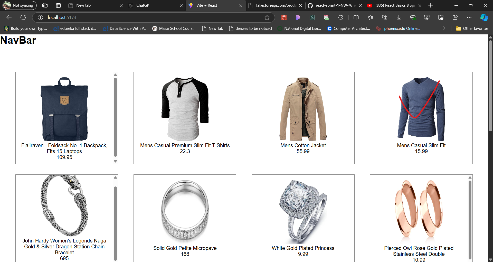
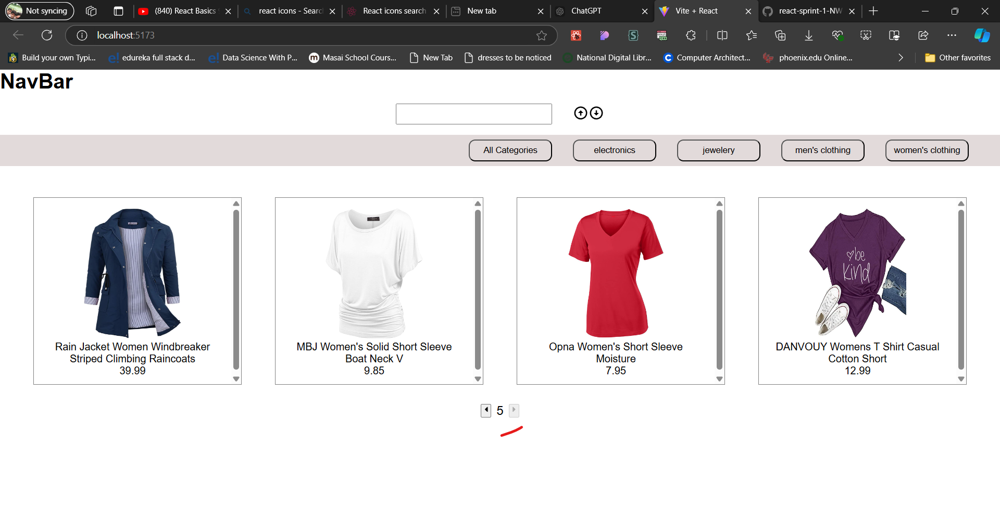
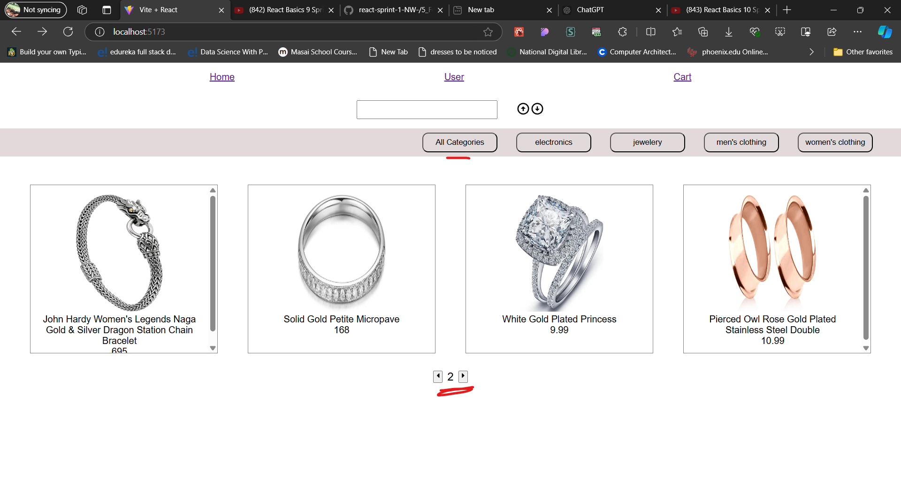

paste the babel cdn
ex- 

--------------------------------------------------------------------------------------------------------------------------
## ----------------------------spring_4_day_4-------------------------------------

1) when we controll the UI change of elements like inputs state then these components are know to be controlled components
2) we need a ting that creates us a normal react app structure and also it sholud provide variaous functionality in order to bulid a complex application using react. that is  bundler
3) so we have main three bundler to create react app
   1) create-react-app(CRA)
   2) Vite
   3) Parcel
   start with vite
4) npm = node package modules it is not , it is except the node package modules
5) npm -> is a ocean of packages that server what ever a developer needs to build
6) npx create-react-app-> creat a react app, but it execute the nom package modules
---------------creating react app using vite-----------------
1) npm install -D vite
2) create a index.html file
--------------------other way also--------------
1) npm create vite@latest
2) Project name: ... secondVite
    √ Package name: ... secondvite
    √ Select a framework: » React
    √ Select a variant: » JavaScript
3) cd secondVite
  npm install
  npm run dev

* install the extension ES7+ React/Redux/React-Native snippets
* 
-------------------------------------------------------------------
--------to create any dynamic website you should to follow below steps
1) create the static version of that website
2) we need to figure out where to add dynamic nature to webpage i.e, adding state 
3) divede the code you have written into components if possible
4) check if the logic and code are working with tests
---------------------------------------------------------------------
--------------------create a todo app-------------------------
step-1: create the static version of that website

1) npm create vite@latest
2) cd 3_todo
  npm install
  npm run dev
3) modify the codes

step-2:we need to figure out where to add dynamic nature to webpage i.e, adding state 

--------------------------------------------------------------------------------------------------
## --------------------spring_4_day_5 ------------------------------------------------------------
Q - what is incese in scale for components
-> extension for react-js in vs code is --- ES7 + React/Redux/React-Native snippets
---------------------- note------------------------------------
in React when ever a parent components want to communicate with child components then that will happped by props 
  but
  when child components wnat to communicate with parent then that will happped by the function(callback)

## -----------------------spring_4_day-6 : for router and useeffect concetp-------------------------------------

step-1: npm create vite@latest
step-2:   cd 1useEffect
          npm install
          npm run dev
step-3; 

--------------------

useEffect is used to call a function onec the render catually happped
ex--

output-

note--
focess this error 

we should not usse the async with useEffect beause async return the promises and useEffect must not return anything besides a function, which is used for clean-up. so for that we we use a function which have this async to fetch the data. 
solve-

--------------------
-----------------useEffect() usecase-1: with empty dependecy array like- useEffect(func,[])--------------------------------------
so,

--output---

by observing output we can say that if the useEffect has empty array dependecy then that useEffect will call one time after once render not after each render.
-----------------useEffect() usecase-2: with empty dependecy array like- useEffect(func)---------------------

--output--

so by observing the output we can say that if we have useEffect without  empty array then that useEffect will call each time after the render.

-----------------useEffect() usecase-3: with  dependecy array like- useEffect(func,dependecy_aarray)---------------------

--output---

now after clcik on ad-task button 

here after click on add-task button that useEffect has call beausce in that depenecy array we mantain the taskList to change its state.
now see to inpput fileds
code image--

--output--

-----------------useEffect() usecase-4: with callback inside callback cleanUp functiion and dependecy array like- useEffect(func)---------------
code--

--output---

then after clcik on add task

----------now routrs----------------------------------------
npm create vite@latest
cd 2nd_1Routing
  npm install
  npm run dev
---
react-router---> 
1) for the 1st render we get a bundle with UI + Data 
2) in single page application , no reload should take place  why?, beacuse as reload means getting both UI + Data thats why react works in a way where response only have Data comming from server.
3) when our website got relaod then all the data related to that website will stored in router and based on url it will render, that data.
4) install the npm install react-router-dom

## ---------------------------------------spring_4_day_7: for router concept-----------------------------
1) npm create vite@latest
2) 3rd_2Routing
3)  cd 3rd_2Routing
  npm install
  npm run dev
4)  npm install react-router-dom

## --------- use this website to use the apis ---------------

----------------------------------------------------------------
5) six types of Routing 
   1) Normal Routing
   2) Link Routing
   3) Dynamic Routing/ emplate Routing
   4) Nested Routing
   5) custom Routing
   6) Redirecting Routing

6) Link Routing--> when ever we yse the Link tag then reload doesn't happend when we go from one page to other using this Link tag.   
 

--output----

 1) Dynamic Routing/ emplate Routing---> it is used to create a dynatic route path 
   1) useParams()--> Returns an object of key/value pairs of the dynamic params from the current URL that were matched by the route path
   
   
-----------------------------------
   
   
----------------------------------

--output---

---------------------------------------------------------
Q- how to make our route redirect to some link or some page autometically.
ans--> 

to 

ans--> using the six type of Rotuting called as Redirecting Routing 

--output----

---------------------------------------------------------------
problem--
  to fix this type of proble we are using the  4) Nested Routing
 examplee--
 
 -------------------------
 
 
 
 
 

 -----------------
 
## ------------------------------------------------------------------------------------------------------------------
## ------------------Spring_4_day_8 continue the project-----------------------------------------------------------
1) npm create vite@latest
  3rd_3Routing
  cd 3rd_3Routing
  npm install
  npm install react-router-dom
  npm run dev
2) copy all the code of Spring_4_daay_7 and then continuneee
3)  go to thie website for style https://mui.com/material-ui/
4)  go to get stated and click on installation and copy the command and paste in terminal.
5)  
6)  
7)  npm install @mui/material @emotion/react @emotion/styled
8)   copy the and paste in code of Home
9)  
10) it is comming error so comment it 
11) 
12) to fix this error again  in terimal  npm install @mui/icons-material
13) 
14) 
15) 
16) 
17) 
18) 
19) now to filter the itmes based on category 
20) this are the apis  , 
21) now to fetch the data based on category we have to write the code using the useEffect().
22) 
23) 
24) 
25) -------output------------------
26) 
27) 
28) 
29) 
--------------------

## -------------------------------------Spring_4_day_9------------------------------------------------------------------
1) npm create vite@latest
  3rd_3Routing
  cd 3rd_4Routing
  npm install
  npm install react-router-dom
  npm install @mui/material @emotion/react @emotion/styled
  npm install @mui/icons-material 
  npm run dev
2) copy all the code of Spring_4_daay_8 and then continune
3) now we are going to do refectring the our code--> means mantaing the code in proper way with respect to file.
4) create two components 1) Categories.jsx 2)ProductList.jsx 
5) create a folder as utility and create a file basicOp.js inside that utility
6) see the codes
7) Categories.jsx code is 
8) 
9) ProductList.jsx code is 
10) 
11) utility->basicOp.js code is 
12) 
13) 
14) now Home.jsx code is 
15) 
16) 
17) 
18) output is 
19) 
20) 
21) ------------------Now we are going to apply the paggination feacture to this project--------------------------------------
22) now to include the icons in react we can use the react-icons for that follow the below image to include the react-icon first we need to download it using ternimal => npm install react-icons
23) 
24) now see the codes 
25) code of Home.jsx file  , 
26) code of ProductList.jsx file 
27) code of Category.jsx file 
28) code of utility->basicOp.js file ,
29) -----------------output-----------------------
30) ,,
31) after this all output there is some few debugging problems are  below..
32) when we click on parttiular category then that page number is not update as initall -> 
33) intiall we are in first page but when we are searching a product which is not availabe in first page(within four product) then other page product is comming which match the search 
34) now we fix this begging by modify the codes and we also create two files User2.jsx and Cart.jsx
35) see the code to create and modify the code , 
36) now we  are going to fix the debugging see the code.
37) Home.jsx code is   , 
38) Category.jsx file code is  here we are modify the code of Home.jsx and Category.jsx beasus in the home.jsx that input fild are there and in the Category.jsx that all the category are there on click them we are not getting proper output after this all we are getting proper output..
39) ---- output-----------------------
40)  ,  , 
41)  , 
42) now one more begugging is there when we click on other link like on user or cart after that when we click on again in Home then that product are comming from starting but not from where we click on that other link like if we are in second page of home and we click on cart then again we clik on Home then it will code as first page  that is bed user expereance so to fix that degging we have to apply the concept of 'context'.....
43)  we know that when two or more child element of same parent element want the a same state-managemt varaible then we keep that state variable in parent element in form of props so that all the child element can access so when child component want a property from parent element and there is long chain between child element to parent element where parent have the state variable to sent it to child it can have a problem called as prop drilling
44)  Prop drilling in React refers to the process of passing data from a parent component to a deeply nested child component through several intermediary components, even though those intermediary components do not need the data. It can lead to complicated and difficult-to-maintain code when many components are involved.
45) ## ------------- How to Avoid Prop Drilling------------->
     ans)React Context API: The Context API allows you to create global variables (context) that can be passed down to any child component without needing to pass props explicitly at every level.

46)   by lokking this image there the parent elemnt is App.jsx and child are navbar.jsx and user.jsx so if the user.jsx need a property then it can direncty access from context api that is gloably access across each compoents.
47)  now to use the Context in this application we are crating a folder name as contexts and inside it we are creating a file to handle the paddingtion that file is PaginationContext.jsx.
48)  see the codes with respect to files 
49)  App.jsx code is 
50)  Home.jsx code is  ,  , 
51) code of PaginationContext.jsx file  
52) Categories.jsx file code is 
53) code of NavBar.jsx and Productlist.jsx file 
54) -------------OutPut---------------------
55)  ,  ,  , 
56) so by above image we can see the proble which was happing that had resolved but that is for also related to pagitation but for categories by lokking the below image you can identify so to resolve it also we need to make the category state variable as glabally using the context variable.  ,  , 
57) 

